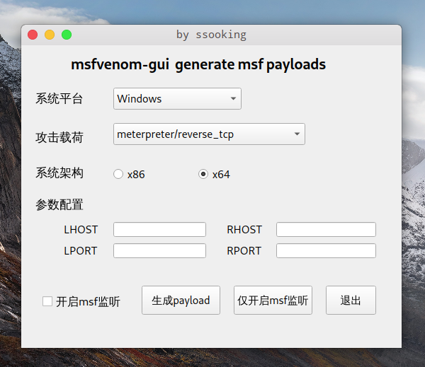

# msfvenom-gui

调用msfvenom，便于测试情况下生成常用正向及反弹shell的图形化小工具，快速开启msf监听。

payload特点：

- ​	仅用于测试的payload，未使用任何编码
- ​	正向shell参数：RHOST、RPORT
- ​	反弹shell参数：LHOST、LPORT

安装pyqt5依赖

```bash
python3 -m pip install PyQt5
```

开启msf监听时，调用了gnome-terminal，适用于gnome桌面。其他桌面环境请修改代码第322行：

```bash
os.system("gnome-terminal -- msfconsole -r /tmp/msflistener.rc")
```


